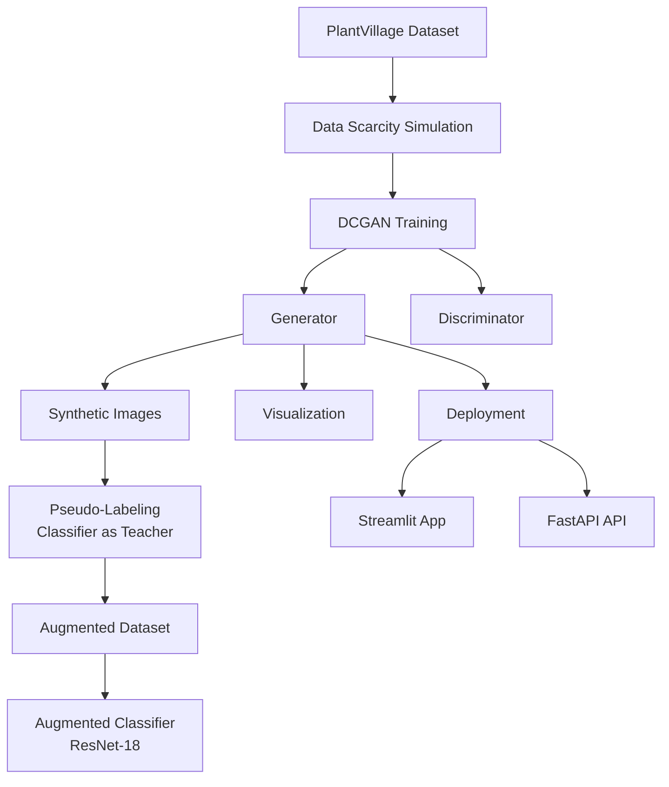

# 🌱 Project 3: Synthetic Crop Leaf Disease Image Generation using DCGAN

A complete end-to-end system that uses **Deep Convolutional GANs (DCGANs)** to generate realistic crop leaf disease images and mitigate **data scarcity and class imbalance** in agricultural image classification.

This repository contains everything required to **prepare data, train a DCGAN, generate synthetic images, augment classifiers, evaluate performance, and deploy the system via UI & API**.

---

## 📌 Why this project?

Image-based crop disease detection systems are widely used in modern agriculture.However, real-world agricultural datasets often suffer from:

- Severe class imbalance (rare diseases have very few samples)
- Limited data availability (seasonal, regional constraints)
- High cost of expert-labeled images
    

Traditional augmentation (flip, rotate, color jitter) cannot capture **complex disease patterns** such as lesion texture, vein distortion, and color gradients.

The core problem addressed in this project is:
**How can realistic synthetic crop leaf disease images be generated and effectively utilized to mitigate data scarcity and improve disease classification accuracy?**

---

## 🧭 What does this project do?

- Trains a **Deep Convolutional GAN (DCGAN)** on a deliberately scarce crop leaf disease dataset
- Generates **high-quality synthetic diseased leaf images** that preserve realistic texture and lesion patterns
- Applies a pseudo-labeling strategy to assign disease classes to GAN-generated images using a trained classifier
- Augments real training data with high-confidence synthetic samples to mitigate class imbalance
- Trains and compares:
   - a **Baseline classifier** trained exclusively on real images
   - an **Augmented classifier** trained on real + synthetic images
- Deploys the trained generator through:
   - an interactive Streamlit web application
   - a FastAPI-based REST service for programmatic access
---

## 🧠 System Overview

```text
PlantVillage Dataset
          ↓
Data Scarcity Simulation
          ↓
DCGAN Training (Unconditional)
          ↓
Synthetic Leaf Images
          ↓
Pseudo-labeling (Classifier as Teacher)
          ↓
Classifier Training
          ↓
Evaluation + Deployment   
```

---

## 📁 Repository Structure

```text
Synthetic-Crop-Leaf-Disease-Image-Generation-Using-DCGAN/
├── configs/              # YAML configs (data & training)
├── data/                 # Real + synthetic datasets
├── checkpoints/          # GAN & classifier weights
├── logs/                 # Training & inference logs
├── samples/              # Generated image samples
├── figures/              # Plots & visualizations
├── src/                  # Core source code
│   ├── data_loader.py
│   ├── generator.py
│   ├── discriminator.py
│   ├── dcgan_model.py
│   ├── train_dcgan.py
│   ├── gan_evaluation.py
│   ├── classifier_train.py
│   ├── classifier_eval.py
│   ├── visualization.py
│   ├── inference.py
│   ├── app_leaf_gan.py
│   ├── api_leaf_gan.py
│   └── utils/
│       ├── config.py
│       ├── logger.py
│       ├── metrics.py
│       ├── monitoring.py
│       └── classifier_inference.py
├── requirements.txt
└── README.md
```

> NOTE: Large datasets, checkpoints, logs, and generated images are excluded via ```.gitignore```.

---

## 🏗️ Architecture Flow



---

## 🧩 Modules & Design
### I. 📦 Data Pipeline & Preprocessing

**Source:**

- **[PlantVillage Dataset](https://www.kaggle.com/datasets/abdallahalidev/plantvillage-dataset)** (Kaggle)
- Multi-crop, multi-disease
- 38 disease + healthy classes
- Crops include: Tomato, Potato, Grape, Maize (Corn), Pepper, Apple, Orange, Strawberry, Cherry, Squash (and other related crops)
- 54,305 RGB images (original)

**Kaggle Setup (Required):**

1)  Go to **Kaggle → Account → Create New API Token**
2)  Download ```kaggle.json```
3)  Place it in:
    ```bash
    ~/.kaggle/kaggle.json           # macOS / Linux
    C:\Users\\.kaggle\kaggle.json   # Windows
    ```
4)  **To set permissions, run:**
    ```bash
    chmod 600 ~/.kaggle/kaggle.json
    ```
5)  **To download dataset, run:**
     ```bash
     python scripts/download_dataset.py
     ```

#### Data Scarcity Simulation

To reflect real-world agricultural data constraints, the original dataset was deliberately reduced to simulate **limited and imbalanced field data**.

##### Scarcity Strategy
- Maximum of **100 images per class**
- **Random sampling with a fixed seed** to ensure reproducibility
- Preserves natural **class imbalance**, especially for rare disease categories

This setup enables a realistic evaluation of GAN-based data augmentation under constrained conditions.

**For dataset reduction, run:**
```bash
python scripts/create_scarce_subset_all_classes.py
```

#### 📂 Dataset Splitting
The reduced dataset is split into non-overlapping subsets to prevent data leakage and ensure fair evaluation.

**Split Ratio**
     - **Training:** 70% (GAN and classifier training)
     - **Validation:** 15% (monitoring and tuning)
     - **Testing:** 15% (final classifier evaluation)

**For splitting dataset, run:**
```bash
python scripts/split_dataset.py
```

#### 📁 Final Dataset Structure

```text
data/Real/
├── Train/
├── Validation/
└── Testing/
```

This structured pipeline ensures:
- GAN training uses only training data
- Classifier evaluation remains unbiased
- Fair comparison between baseline and augmented models

---


### II. 🧩 Model Architecture

This project uses a **Deep Convolutional Generative Adversarial Network (DCGAN)** tailored for **64×64 RGB crop leaf images**.  
The architecture follows DCGAN best practices to capture fine-grained disease patterns such as lesions, texture irregularities, and color variations.

#### Generator (G)
Transforms a latent noise vector into a realistic crop leaf image.

- **Input:** Latent vector  
  z∼N(0,I)

- **Architecture Overview:**
  - Progressive upsampling using **ConvTranspose2D** layers
  - **Batch Normalization + ReLU** activations
  - Final **Tanh** activation for pixel normalization

```text
[z (100)]
 └─ ConvTranspose2D (100 → 512, k=4, s=1, p=0)
     └─ BatchNorm + ReLU        → (512, 4, 4)
         └─ ConvTranspose2D (512 → 256, k=4, s=2, p=1)
             └─ BatchNorm + ReLU → (256, 8, 8)
                 └─ ConvTranspose2D (256 → 128, k=4, s=2, p=1)
                     └─ BatchNorm + ReLU → (128, 16, 16)
                         └─ ConvTranspose2D (128 → 64, k=4, s=2, p=1)
                             └─ BatchNorm + ReLU → (64, 32, 32)
                                 └─ ConvTranspose2D (64 → 3, k=4, s=2, p=1)
                                     └─ Tanh → (3, 64, 64)
```

- Output:
  **64 × 64 × 3 RGB image**, pixel range **\[−1, 1]**

#### Discriminator (D)
Distinguishs between real and synthetic crop leaf images.

- **Input:**
  64 × 64 × 3 RGB image
  
- **Architecture Overview:**
   - Stride-based downsampling using **Conv2D**
   - **LeakyReLU (0.2)** activations
   - **Batch Normalization** for stability
   - Final **Sigmoid** output for real/fake probability

```text
Input Image (3, 64, 64)
 └─ Conv2D (3 → 64, k=4, s=2, p=1) + LeakyReLU
     └─ (64, 32, 32)
         └─ Conv2D (64 → 128, k=4, s=2, p=1) + BatchNorm + LeakyReLU
             └─ (128, 16, 16)
                 └─ Conv2D (128 → 256, k=4, s=2, p=1) + BatchNorm + LeakyReLU
                     └─ (256, 8, 8)
                         └─ Conv2D (256 → 512, k=4, s=2, p=1) + BatchNorm + LeakyReLU
                             └─ (512, 4, 4)
                                 └─ Conv2D (512 → 1, k=4, s=1, p=0)
                                     └─ Sigmoid → P(real)
```

- **Output:**
  Scalar probability indicating whether the image is real or fake

This architecture enables stable adversarial training and effective modeling of complex crop leaf disease characteristics under data-scarce conditions.

---

### III. 🔁 Training

This project implements a **stable and reproducible DCGAN training pipeline** designed to learn the visual distribution of crop leaf disease images under **data-scarce conditions**.

The training logic is implemented in `src/train_gan.py`
**To train the DC GAN, run:**
```bash
python src/train_dcgan.py
```

#### Training Loop (Per Epoch)
Each training epoch follows the standard DCGAN adversarial procedure:
1) **Real Image Sampling**
    - A batch of real crop leaf images is loaded
    - Images are normalized to \[−1, 1]
2) **Noise Vector Sampling**
    - Latent vectors sampled from z∼N(0,I)
    - Latent dimension = 100
3) Fake Image Generation
    - Synthetic images generated using:
        `fake_images = Generator(z)`
4) Discriminator Training
    - Trained on:
      - Real images labeled as **0.9** (label smoothing)
      - Fake images labeled as **0**
    - Loss: **Binary Cross-Entropy (BCE)**
5) Generator Training
    - Discriminator weights are frozen
    - Generator optimized to maximize: `D(G(z)) ≈ 1`

#### Training Stabilization Techniques
To ensure stable convergence and prevent mode collapse, the following techniques are applied:
- **Label smoothing** (real = 0.9)
- **Strided convolutions** instead of pooling layers
- **Batch Normalization** in both Generator and Discriminator
- Adam Optimizer
  - Learning rate: `0.0002`
  - β₁ = `0.5`, β₂ = `0.999`

#### Checkpointing & Logging

##### Checkpoints
Generator and Discriminator weights are saved every **50 epochs**:
```text
checkpoints/
├── G_epoch_050.pth
├── G_epoch_100.pth
├── G_epoch_150.pth
├── D_epoch_050.pth
├── D_epoch_100.pth
└── D_epoch_150.pth
```

##### Training Logs
- Generator and Discriminator losses logged after every epoch
- Stored as CSV for reproducibility and visualization: ```logs/training_log.csv```
<!--  -->
<p align="center">
  
  <br>
  <em>Training Losses for Generator and Discriminator</em>
</p>

##### Sample Visualization
- Image grids generated periodically to visually inspect training progress:
```text
samples/
├── samples_epoch_100.png
└── samples_epoch_150.png
```
<!--  -->
<p align="center">
  
  <br>
  <em>Samples at Epoch 100</em>
</p>
<!--  -->
<p align="center">
  
  <br>
  <em>Samples at Epoch 150</em>
</p>


---

### IV. 🧪 Classifier Training & Evaluation

A central contribution of this project is demonstrating that **GAN-generated synthetic images can measurably improve crop disease classification performance** when integrated correctly.

#### Baseline Classifier

The baseline model establishes performance using **real data only**.

**Configuration**
- Architecture: **ResNet-18**
- Training data: Real crop leaf images
- Loss function: Cross-Entropy Loss
- Output classes: All crop–disease categories

**To train the classifier, run:**
```bash
python src/classifier_train.py
```

Saved model: ```checkpoints/classifier_baseline.pth```

#### GAN-Augmented Classifier (Pseudo-Labeling Strategy)
Instead of introducing a separate synthetic class, a **pseudo-labeling pipeline** is used to ensure class-consistent augmentation.

##### Pseudo-Labeling Pipeline
1) DCGAN generates unlabeled synthetic leaf images
2) The baseline classifier acts as a teacher model
3) Predicted labels with confidence ≥ 0.75 are accepted
4) Synthetic images are stored directly in the corresponding disease folders

Synthetic data location: ```data/synthetic_pseudo/```

**To train the GAN-Augmented Classifier, run:**
```bash
python src/classifier_train.py
```
Saved model: ```checkpoints/classifier_augmented.pth```

#### Classification Results
Evaluation is performed on a **held-out real test set** to ensure fairness.

| Model          | Accuracy    | F1-Score  |
|----------------|-------------|-----------|
| Baseline       | 62.9%       | 0.61      |
| GAN-Augmented  | **78.2%**   | **0.77**  |

**Key Observation:**
GAN-based augmentation produces a **substantial improvement in both accuracy and F1-score**, with the largest gains observed for under-represented disease classes.

#### GAN & System Evaluation

##### GAN-Level Evaluation
**Visual Inspection**
- Realistic leaf shapes and textures
- Plausible lesion patterns and color gradients
- No obvious checkerboard or collapse artifacts

**To visulaize, run:**
```bash
python src/visualization.py
```

Outputs:
- Sample grids
- Latent space interpolation images

##### Latent Space Interpolation
Smooth interpolation between latent vectors demonstrates:
- Continuity in the learned latent space
- Meaningful semantic transitions between disease patterns
Output:
```text
figures/latent_interpolation.png
```
<!--  -->
<p align="center">
  
  <br>
  <em>Latent Space Interpolation</em>
</p>

##### Quantitative Evaluation
Metric: **Inception Score (IS)**

**To evalute GAN, run:**
```bash
python src/gan_evaluation.py
```
Result:
**IS ≈ 3.0 ± 0.23**
This indicates:
- Reasonable image diversity
- Sufficient realism for data augmentation tasks

##### Diversity & Bias Analysis
GAN-generated images are passed through the trained classifier to analyze output distribution.

Purpose
- Detect mode dominance
- Identify over-represented disease patterns

Output:
```
figures/gan_class_distribution.png
```
<!--  -->
<p align="center">
  
  <br>
  <em>Generated Samples Class Distribution</em>
</p>
A mild bias toward visually dominant diseases is observed — an expected behavior for **unconditional GANs**.

---

### V. 🚀 Deployment & Application Layer

This project includes multiple deployment interfaces to make the trained DCGAN **accessible for interactive use, programmatic access, and offline generation**.

#### 🖥️ Streamlit Web Application

Script: `src/app_leaf_gan.py`

**To run the web application locally:**

```bash
streamlit run src/app_leaf_gan.py
```

Features
- Generate **synthetic crop leaf disease images** using the trained DCGAN
- **Classifier-based interpretation** of generated images
- **Class distribution visualization** to analyze GAN diversity and bias
- **Real-time inference analytics** (latency and usage logging)
- Option to **download generated images as a ZIP file**
<!--  -->
<!--  -->
<!--  -->
<p align="center">
  
  <br>
  <em>Streamlit UI - Synthetic Images Generation</em>
</p>
<p align="center">
  
  <br>
  <em>Streamlit UI - Synthetic Images Class Distribution Visualization</em>
</p>
<p align="center">
  
  <br>
  <em>Streamlit UI - Synthetic Images Class Distribution and Download as .zip option</em>
</p>
This interface is designed for:
- Demonstrations
- Educational use
- Rapid qualitative inspection of GAN outputs

#### 🌐 REST API (FastAPI)
Script: ```src/api_leaf_gan.py```

**To start the API server, run:**
```bash
uvicorn src.api_leaf_gan:app --reload
```
Available Endpoints
```bash
GET /generate
```

    - Generates synthetic crop leaf images
    - Returns images encoded in Base64
    - Supports configurable batch sizes
  
Additional Features
- Logs **inference latency**
- Tracks **API usage statistics**
- Designed for integration with external agritech or research systems

#### 🧪 CLI Inference Tool
Script: ```src/inference.py```

This tool enables **offline batch generation** of synthetic images without a UI.

Use cases include:

- Dataset augmentation
- Research experiments
- Automated pipelines

Example usage:
```bash
python src/inference.py
```

---

### VI. 📈 Monitoring, Versioning & Continuous Improvement

To ensure reliability, reproducibility, and future extensibility, the system incorporates structured **monitoring**, **model versioning**, and clear paths for **continuous improvement**.


#### 🔍 Monitoring & Logging

Monitoring is implemented to track both **model behavior** and **system usage** during training and deployment.

**Implementation:**
- `utils/logger.py`
- `utils/monitoring.py`

##### Tracked Metrics

- **GAN Training Metrics**
  - Generator and Discriminator loss per epoch
  - Stored as CSV logs for analysis and visualization

- **Inference Performance**
  - Per-request inference latency
  - Batch size vs response time

- **Usage Analytics**
  - Number of images generated
  - Most frequently predicted disease classes
  - Source of inference (Streamlit / API)

- **Metadata Logging**
  - Model version used
  - Timestamped inference records
  - Configuration snapshots for reproducibility

These logs enable:
- Debugging performance regressions  
- Identifying usage patterns  
- Supporting future retraining decisions 

---

## ⚠️ Limitations

While the proposed system demonstrates clear benefits of GAN-based data augmentation, several limitations remain:

- The DCGAN is trained without class conditioning, which prevents explicit control over the disease type during image generation.
- The generator may favor visually prominent disease features, leading to mild overrepresentation of certain classes.
- Although confidence-based filtering is applied, incorrect classifier predictions can still introduce limited label noise into the synthetic dataset.
- All images are generated at **64×64 resolution**, which restricts fine-grained lesion detail and vein-level texture representation.
- Fréchet Inception Distance (FID) was not implemented; evaluation relies primarily on Inception Score and qualitative analysis.

These limitations highlight opportunities for architectural and methodological improvements in future work.

---

## 🔮 Future Work & Extensions

The system is designed to be modular and extensible. Potential future enhancements include:

- Enable direct control over disease type during generation
- **Advanced GAN Architectures** like WGAN-GP for improved stability, StyleGAN for higher fidelity synthesis
- **Higher-Resolution Image Generation**: 128×128 and 256×256 leaf images
- **Region- and Season-Specific Modeling**
- **Automated Retraining Pipelines**

---

## 👥 Team

<table>
  <tr>
      <td align="center">
      <a href="https://github.com/ishitachowdary">
        
        <br />
        <sub><b>Ishitha Chowdary</b></sub>
      </a>
      <br />
    </td>
    <td align="center">
      <a href="https://github.com/LaxmiVarshithaCH">
        
        <br />
        <sub><b>Chennupalli Laxmi Varshitha</b></sub>
      </a>
      <br />
    </td>
    <td align="center">
      <a href="https://github.com/Jhansi652">
        
        <br />
        <sub><b>Y. Jhansi</b></sub>
      </a>
      <br />
    </td>
      <td align="center">
      <a href="https://github.com/2300033338">
        
        <br />
        <sub><b>V. Swarna Blessy</b></sub>
      </a>
      <br />
    </td>
      <td align="center">
      <a href="https://github.com/2300030435">
        
        <br />
        <sub><b>MD. Muskan</b></sub>
      </a>
      <br />
    </td>
      <td align="center">
      <a href="https://github.com/likhil2300030419">
        
        <br />
        <sub><b>Likhil Sir Sai</b></sub>
      </a>
      <br />
    </td>
  </tr>
</table>

---

## 📬 Feedback & Contributions

Feedback, suggestions, and contributions are welcome.

- If you encounter bugs, unexpected behavior, or performance issues, please **open an issue**.
- For improvements, optimizations, or new features, feel free to **submit a pull request**.
- Discussions on alternative architectures, evaluation strategies, or real-world deployment scenarios are encouraged.

---

